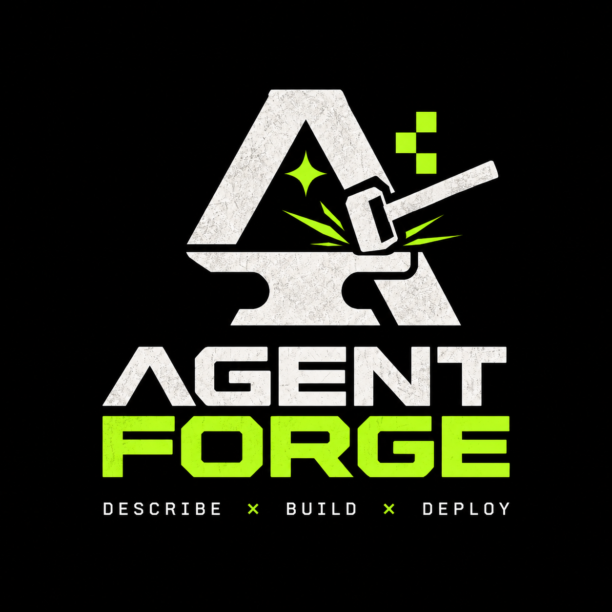

<div align="center">



# ProAgents

**Forge specialized AI agents from incomplete ideas.**

An open-source agentic CLI + Agent Skill that turns *"I want an agent that debugs production"*
into a validated, buildable multi-agent system — through progressive questioning, pluggable
context frameworks and deterministic architecture generation.

`npm i -g proagent` · [Documentation](https://proagents-dev.github.io/proagents/) · MIT

</div>

---

## Why?

Modern coding agents can build almost anything — but when you ask one to build *an agent*,
it guesses. It fills your vague intent with silent assumptions about environments,
permissions, approval gates and tools, then hands you a prompt-shaped artifact nobody can
validate.

ProAgents refuses to guess. It interrogates:

```
"I want an agent that helps developers debug production issues."
        ↓
Understand intent → identify unknowns → ask the highest-value question
        ↓
Process answer → derive NEW questions (Kubernetes? → production access?)
        ↓
Detect contradictions ("read-only" vs "auto-restart") → force resolution
        ↓
Sufficient confidence → agent specification → validate → build skills
```

Questions are **derived from your previous answers**, not pulled from a static
questionnaire. The output is not a prompt — it's a validated, machine-readable architecture
plus generated agent skills.

## Install

```bash
npm install -g proagent
# or run without installing
npx proagent --help
```

Node.js 20+. Works on macOS, Linux and Windows.

## Quickstart

```bash
# 1. start a session (interactive prompt, or pass --intent)
proagent init --intent "I want an agent that helps developers debug production issues"

# 2. answer high-value questions, one at a time — each changes the next
proagent question
proagent answer q_001 "It diagnoses incidents in our TypeScript services and proposes patches for humans to approve"

# 3. ground it in real context (optional)
proagent context frameworks
proagent context "incident runbooks" --context-framework filesystem

# 4. build it
proagent status      # readiness: READY when high-impact coverage is sufficient
proagent spec        # agent architecture: agents, graph, permissions
proagent validate    # deterministic checks — errors block the build
proagent build       # → .agents/skills/<agent>/SKILL.md + agent.json
```

## For AI agents

ProAgents is agent-agnostic and JSON-first — every operation has deterministic
`--json` output, so another agent (Claude Code, Codex, Cursor, …) can drive the whole
flow:

```bash
proagent init --intent "..." --non-interactive --json
proagent answer q_001 "..." --json
# repeat question/answer until readiness === "READY"
proagent build --json
```

The repo ships a ready-made skill that teaches any agent this loop:

```bash
npx skills add proagents-dev/proagents
```

## What gets generated

```
.agents/skills/
├── developers-debug-researcher/
│   ├── SKILL.md                     # workflow + progressive disclosure
│   ├── references/permissions.md    # normative permission model
│   ├── references/escalation.md
│   └── agent.json                   # machine-readable contract
├── developers-debug-implementer/
├── developers-debug-reviewer/       # team derived when concerns split
└── agent-architecture.json          # full graph + runtime requirements
```

Handoffs pass **named artifacts** (research-findings, patches, review-verdict) — never a
shared context pool. Permissions, human-approval gates and secret boundaries are validated
before anything is generated. Markdown informs; runtime boundaries enforce.

## Context frameworks

| Framework | Origin | Notes |
|---|---|---|
| `filesystem` | builtin | deterministic keyword/IDF retrieval, always available |
| `git` | builtin | commit-history retrieval |
| `agents-code-context` | optional | [ACC](https://www.npmjs.com/package/acc-code-context) — architecture graph, dependencies, impact; used only if installed |
| *yours* | external | `--context-framework ./my-framework.mjs` or a git URL — no core changes needed |

See [writing an adapter](https://proagents-dev.github.io/proagents/context/adapters).

## Architecture

```
┌─────────────────────────────────────┐
│           Agent Skill               │  how an agent should operate
├─────────────────────────────────────┤
│           CLI / Runtime             │  operations + enforcement boundaries
├─────────────────────────────────────┤
│         Question Engine             │  intent → uncertainty → questions (deterministic)
├─────────────────────────────────────┤
│      Context Framework API          │  pluggable retrieval
├──────────┬──────────────┬───────────┤
│   ACC    │    Git       │  Custom   │
└──────────┴──────────────┴───────────┘
```

Layers stay separate. The engine is deterministic and provider-agnostic: no model calls, no
hidden randomness — the same session state always yields the same questions, confidence and
readiness. Runtime capabilities (subagents, delegation, parallelism) are **detected**, never
assumed, and gaps are reported honestly with CLI fallbacks in the generated skills.

## Development

```bash
git clone https://github.com/proagents-dev/proagents
cd proagents
npm install

npm run build        # tsc → dist/
npm test             # vitest
npm run typecheck    # tsc --noEmit

# docs (bun + vitepress)
bun --bun vitepress dev docs
bun --bun vitepress build docs
```

### Project layout

```
├── src/
│   ├── cli/            # command surface (--json everywhere)
│   ├── core/           # engine, session, specification, validation, runtime
│   ├── context/        # framework API + adapters (filesystem, git, acc) + registry
│   └── output/         # terminal rendering
├── .agents/skills/     # shipped proagent skill + generated agents land here
├── docs/               # vitepress site (deployed to GitHub Pages)
├── tests/              # vitest suites
└── examples/           # end-to-end session examples
```

## Contributing

Contributions welcome — see [CONTRIBUTING.md](CONTRIBUTING.md). Good first issues: new
context-framework adapters, question templates, validation rules, docs translations.

## License

[MIT](LICENSE) © ProAgents contributors
